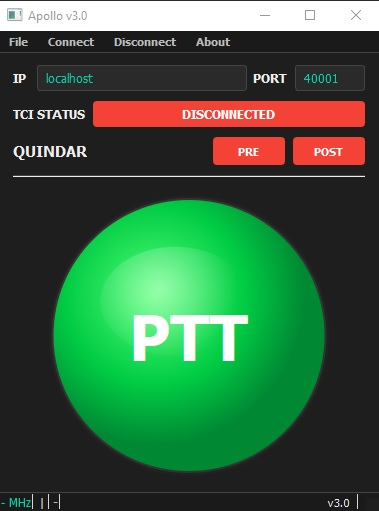
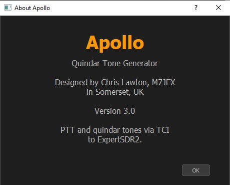

# Apollo
Apollo is a network PTT program for SunSDR radios over TCI with user selectable Quindar tones. Apollo will inject the selected mic directly into the TX audio chain.

## Interface

## About

## Footswitch Setup

